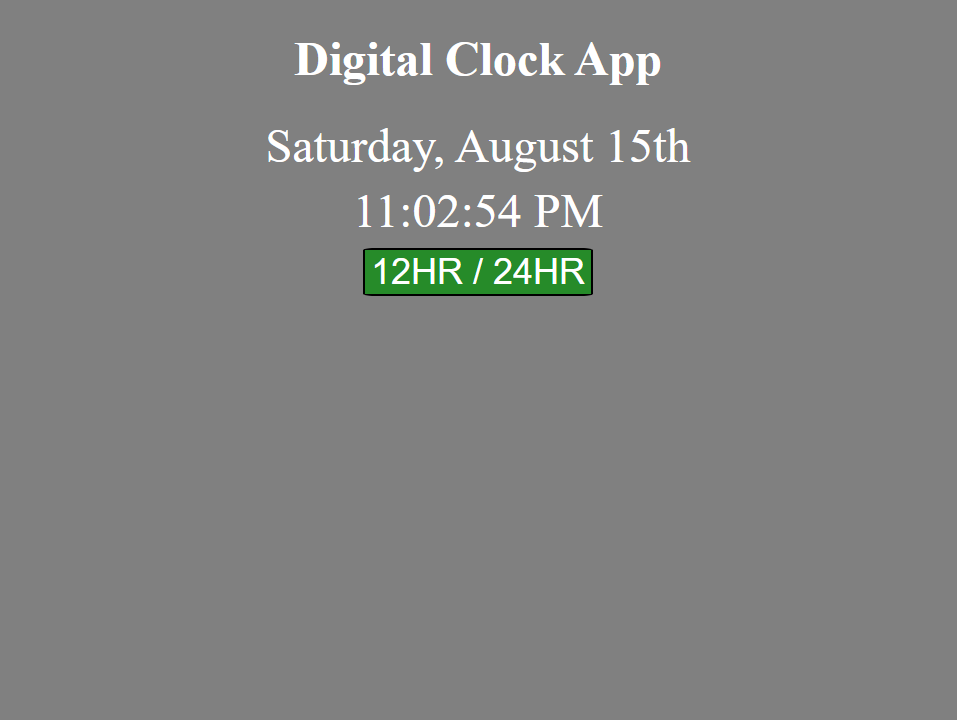

#  Minimalist Digital Clock App
A minimalistic Digital Clock App written entirely in JavaScript, HTML and CSS

Run Code [Here](https://hcuellar-coder.github.io/DigitalClockApp/)

## Minimalist Digital Clock App

## Summary
This app is my first step to becoming a programmer and its exciting!

I learned quite a lot of the new ES6 JavaScript syntax as well as some new concepts pertaining to descriptive naming of variables and functions. On a lighter yet functional level, I learned how to calculate time and account for the time difference between military and standard time. I had a lot of fun working on this minimalist digital clock App.

## Author
Heriberto Cuellar – Full Stack Software Developer - [Website](https://heribertocuellar.com) | [LinkedIn](https://linkedin.com/in/heriberto-c-5aa11952)